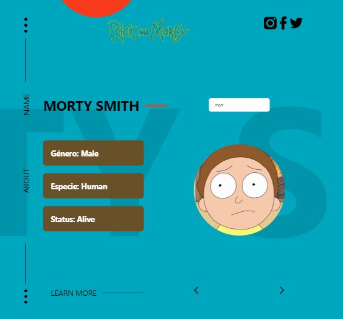

# Rick And Morty App

Rick and Morty project using react and react and morty API.

- Live example -> https://yesmemorales.github.io/rick-and-morty-react/

## Install Project

`npm install`

## Start Project

`npm start`

Runs the app in the development mode. 
Open [http://localhost:3000](http://localhost:3000) to view it in the browser.

